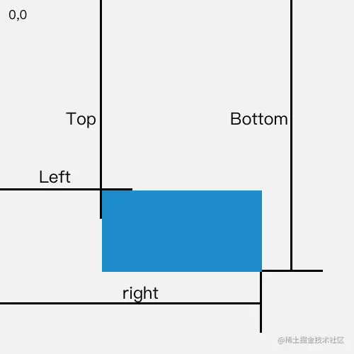

## **✅ 一句话解释**

  

> getBoundingClientRect() 返回一个包含元素大小和其相对于**视口的位置**的 DOMRect 对象。
---
## **✅ 一张图看懂(引用来自掘金社区)**


---
## **📦 返回的是什么？**

  

调用方式：

```
let rect = element.getBoundingClientRect();
```

返回的是一个 **DOMRect 对象**，里面包含这些常用属性：

|**属性名**|**含义**|
|---|---|
|left|元素左边缘距离 **视口左边缘** 的距离（px）|
|right|元素右边缘距离 **视口左边缘** 的距离（= left + width）|
|top|元素上边缘距离 **视口顶部** 的距离（px）|
|bottom|元素下边缘距离 **视口顶部** 的距离（= top + height）|
|width|元素的宽度（不含 margin）|
|height|元素的高度（不含 margin）|
|x、y|和 left、top 是一样的（标准化命名）|

  

---

## **🔍 例子：打印某个 DOM 的位置**

```
<div id="box" style="width: 100px; height: 50px; position: absolute; top: 200px; left: 300px;"></div>
```

```
let box = document.getElementById('box');
let rect = box.getBoundingClientRect();

console.log(rect.top);    // 200（如果没有滚动）
console.log(rect.left);   // 300
console.log(rect.width);  // 100
console.log(rect.height); // 50
```

  

---

## **🌍 注意！它是相对于“视口”的**

  

也就是说：

- 如果你**滚动了页面**，top 和 left 的值会**变化**。
    
- 它**不是**相对于页面的（document），而是**窗口**。
    

  

想获取相对于**整个页面**的位置，需要加上滚动距离：

```
let scrollTop = window.scrollY || document.documentElement.scrollTop;
let scrollLeft = window.scrollX || document.documentElement.scrollLeft;

let rect = element.getBoundingClientRect();
let topInPage = rect.top + scrollTop;
let leftInPage = rect.left + scrollLeft;
```

  

---

## **🎯 实际用途**

- 判断元素是否可见（进入视口）：
    

```
let rect = el.getBoundingClientRect();
if (rect.top >= 0 && rect.bottom <= window.innerHeight) {
  // 元素在视口内
}
```

-   
    
- 计算浮层定位（比如 tooltip、弹窗等）：
    

```
tooltip.style.top = rect.bottom + 'px';
tooltip.style.left = rect.left + 'px';
```

-   
    
- 拖拽判断元素相交、碰撞检测等场景。
    

---

## **🧠 可能踩坑的地方**

|**坑点**|**原因或解决方式**|
|---|---|
|页面滚动后 top/left 会变|因为是相对于**视口**，要转成相对页面坐标需要加上 scrollTop/scrollLeft|
|取不到元素|确保元素已经渲染并出现在 DOM 中，否则为 null 或抛错|
|display: none 的元素返回全是 0|因为没有占据可见空间|
|会被 transform 缩放影响|使用 CSS transform 会影响 getBoundingClientRect() 的宽高和位置|

