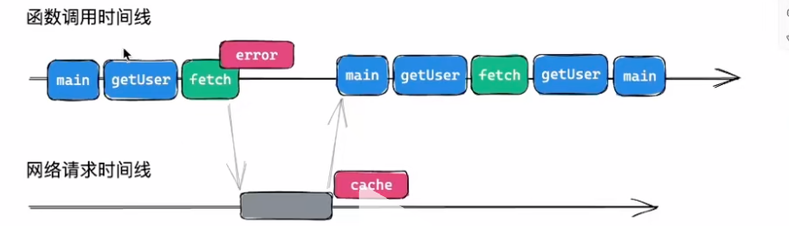

<script setup>
import EliminateAsyncEffect from "@/components/Learning/EliminateAsyncEffect.vue";
</script>



```javascript
async function getUser(){
    return await fetch('https://jsonplaceholder.typicode.com/todos/1').then(response => response.json())
}
async function m1(){
    const user = await getUser();
    //other works
    return user;
}
async function m2(){
    const user = await m1();
    //other works
    return user;
}
async function m3(){
    const user = await m2();
    //other works
    return user;
}
function main(){
    const user = m3()
    console.log(user)
}
main()
```

<EliminateAsyncEffect />